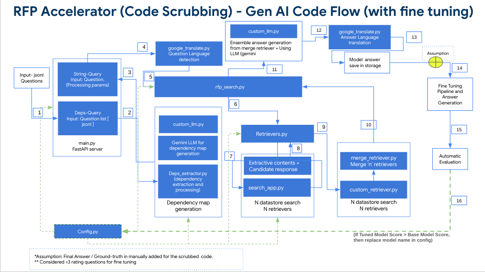

# RFP Accelerator

## Overview

Responding to RFPs (Request for Proposal) & RFIs (Request for Information) is a time-consuming process for Cloud sales and Proposal Hub managers, often taking 80-100 hours per RFP. With the increasing volume of RFPs (over 1000 annually and growing), teams struggle to keep up, leading to prioritization challenges and potential delays.

The **RFP Accelerator** leverages the power of GenAI to automate RFP response generation, significantly reducing the time and effort required. By tapping into existing data sources, this tool helps streamline the RFP process, improve response quality, and free up valuable team resources.

## Key Features

* **Automated RFP Response Generation:** Utilize GenAI algorithms to automatically generate responses to RFP questionnaires.
* **Data-Driven Insights:** Leverage existing data sources to provide comprehensive and accurate responses.
* **Time Savings:** Drastically reduce response time from days to hours, enabling faster turnaround and increased efficiency.
* **Improved Consistency and Quality:** Generate standardized, high-quality responses, minimizing errors and inconsistencies.
* **Enhanced Collaboration:** Streamline the collaboration process between sales, technical, and proposal teams.

## Getting Started

### Code Flow Diagram



### Prerequisites

* **Python 3.10.13+:** Ensure you have a compatible version of Python installed.
* **Virtual Environment (Recommended):** Create a virtual environment to isolate project dependencies.
* **Git:** Required for cloning the repository.
* **GCP:** Required gcp project as pre-requsite. Please refer this [document](gcp-setup.md) for GCP Setup.


### Installation

1. **Clone the Repository:**
```bash
git clone -b <branch_name> <repository_url> 
cd <repository_directory>
```

2. **Create and Activate Virtual Environment (Recommended):**
```bash
python3 -m venv venv
source venv/bin/activate
```

3. **Install Dependencies:**
```bash
pip install -r requirements.txt
```

4. **Initialize google logger for first time**
```
python temp/log_initializer.py <project-name>
```

### Configuration

1. **Edit `config.ini`:** Update the configuration file with your specific project details.

```ini
[deps-parameters]
llm = gemini-1.0-pro-002
temperature = 0.0
max_output_tokens = 1024
deps_context_length = 10

[search-model-parameters]
model_name = gemini-1.0-pro-002
temperature = 0.0
max_output_tokens = 1024
top_p = 0.9
top_k = 40
preview_model = True
page_size = 10
language_translation = gt
embedding_model = textembedding-gecko@003

[project-general]
PROJECT_ID = <your_gcp_project_name>
REGION = <your_gcp_region>
LOG_NAME = Req-Prop-Application-runtime

[datastore]
PROJECT_ID = <your_gcp_project_name>
SEARCH_PROJECT_ID = <your_gcp_project_id>
REGION = us-central1
LOCATION_ID = global
DATA_STORE_LIST = data_store_1, data_store_2
[auth]
PROJECT_ID = 
SECRETS_NAME = 
SECRET_ID = 
[db]
DATABASE_API = 
```

##### **Explanation of `config.ini` Parameters:**

##### **`[deps-parameters]`:** Parameters used for question dependency mapping.
* **`llm`:** The llm used to detect dependency (e.g., "gemini-1.0-pro-002").
* **`temperature`:** Controls the randomness of the dependency LLM's output - (lower values = more deterministic).
* **`max_output_tokens`:** Limits the maximum length of the generated response for dependency llm.
* **`deps_context_length`:** Sets the context window size for the dependency LLM.

##### **`[search-model-parameters]`:** Configures the search functionality.
* **`model_name`:** Specifies the LLM model used for vertex search.
* **`temperature`:** Controls the randomness of the final answer generation model LLM's output.
* **`max_output_tokens`:** Limits the maximum length of the generated response for final answer generation llm.
* **`preview_model`**: (Boolean) Enables/disables the gemini model. Default: `True`.
* **`page_size`**: (Integer) Defines the number of results displayed per page (non grounding, vertex search results pipeline). Default: `10`.
* **`language_translation`**: (String) Sets the language for translation. Default: `gt` (Google Translate) | `mt' -> llm model translation

##### **`[project-general]`:** Defines general project settings.
* **`PROJECT_ID`:** Your Google Cloud Project ID.
* **`REGION`:** Your preferred Google Cloud region.
* **`LOG_NAME`:** Name for your application logs.

##### **`[datastore]`:** Configures Datastore settings. All these configuration will be available within agent builder.

* Please follow the link for creating a vertex search app. [Create a search app](https://cloud.google.com/generative-ai-app-builder/docs/create-engine-es)
* **`PROJECT_ID`:** Your Google Cloud Project ID.
* **`SEARCH_PROJECT_ID`:** Your Datastore project ID.
* **`REGION`:** Your Datastore region ID.

##### **`[auth]`:** Defines authorization project settings.
* **`PROJECT_ID`:** Your Google Cloud Project ID.
* **`SECRETS_NAME`:** Path to the version of the secret name in Secret Manager.
* **`SECRET_ID`:** Name of the secret in Secret Manager.

##### **`[db]`:** Defines database details.
* **`DATABASE_API`:** Your App engine backend deployed service name.


### Running the Project

1. **Start the Server:**
```bash
sudo fuser -k 8000/tcp # Free up port 8000 if needed
gunicorn -w 4 -k uvicorn.workers.UvicornWorker main:app -b 0.0.0.0:8000
```

2. **Send a Request (from another terminal window):**
```bash
curl -X POST -H "Content-Type: application/json" -d '{"expert_request_id":"<your request id>","user_name":"<your user name>","token":"<secret token>"}' "http://0.0.0.0:8000/deps-query" --max-time 30

```
* This command sends a POST request to the `/deps-query` endpoint.
* The `--max-time 30` flag sets a timeout for the request.

3. **Extracting results**

**Output:**
* The generated responses will be stored in the backend database only if the particular expert request id is available in the UI.

4. **Update/Replace Model Name in Config:**
```bash
python automate_model_replacement.py
```

### Input/output customization

* **Input Customization:**
- Refer to the `main.py` file and the `deps-query` placeholder to customize how the input data is processed.

* **Output Customization:**
- Modify the `save_response` function within the `req_prop_packages/rfp_search.py` file to change how responses are formatted and stored in backend db.


## Deployment

For deploying to Google App Engine:

1. **Deploy:**
```bash
gcloud app deploy
```

2. **Endpoint:**
- Visit the App Engine dashboard in your Google Cloud console to find the deployed application's endpoint.

3. **Deployment Configuration:**
- The `app.yaml` file contains the deployment configuration. Consult your team if you need to modify deployment settings.

## Project Structure

```
rfp-model/
├── req_prop_packages/
│ ├── validation_package/
│ ├── config_check.py
│ ├── config.py
│ ├── custom_llm.py
│ ├── custom_retriever.py
│ ├── deps_extractor.py
│ ├── google_translate.py
│ ├── merge_retriever.py
│ ├── retrievers.py
│ ├── rfp_search.py
│ ├── question_retrieval.py
│ ├── search_app.py
│ └── status_output.py
├── prompts/
│ ├── dependency_prompt.txt
│ ├── qa_template.txt
│ └── vertex_search_preamble.txt
├── temp/
│ ├── input_data.jsonl
│ └── rfp-response.db
├── main.py
├── app.yaml
├── cloudbuild.yaml
├── automate_model_replacement.py
├── config.ini
├── contributing.md
├── LICENSE
├── Procfile
└── requirements.txt

```

* **`main.py`:** The main entry point for the FastAPI application.
* **`req_prop_packages/`:** Contains the core logic for RFP processing, search, and response generation.
    - `req_prop_packages/config_chek.py` Automatic config file slection module for CI/CD.
    - `req_prop_packages/config.py` Configuration import handling module.
    - `req_prop_packages/custom_llm.py` Langchain customized llm wrapper code.cd
    - `req_prop_packages/deps_extractor.py` Module for File processing and dependency extraction.
    - `req_prop_packages/google_translate.py` Module for performing google translation.
    - `req_prop_packages/merge_retriever.py` Module for merging multiple retrievers form various sources.
    - `req_prop_packages/retrievers.py` Module for retrievers creation and handling.
    - `req_prop_packages/rfp_search.py` Central control of overall question answering operation.
    - `req_prop_packages/search_app.py` Module for performing vertex search operations.
    - `req_prop_packages/status_output.py` Wrapper code for printing operation logs.
    - `req_prop_packages/question_retrieval.py` Fetch data from the backend database.
    
* **`prompts/`:** Used for storing the necessary prompts.
* **`app.yaml`:** Configuration file for Google App Engine deployment.
* **`config.ini`:** Stores application configuration parameters.
* **`automate_model_replacement.py`:** It replaces the model_name parameter in config.ini file.
* **`requirements.txt`:** Lists the project's Python dependencies.

## Contributing

Contributions are welcome! Please refer to the `contributing.md` file for guidelines on how to contribute to this project.

## License

This project is licensed under the [Apache License] - see the `LICENSE` file for details.