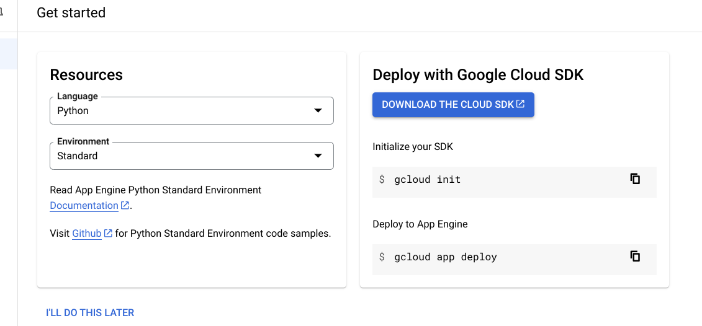
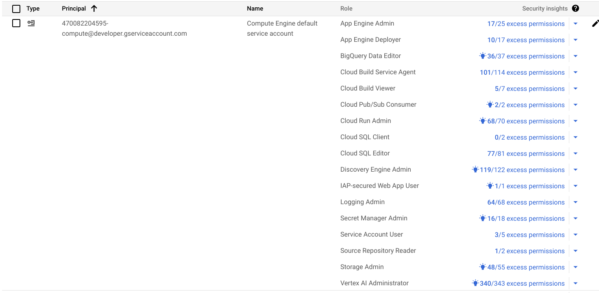

# GCP Project Creation

## Create a Project

1. In the Google Cloud console, go to Menu menu > IAM & Admin > Create a Project.
2. [Go to Create a Project](https://console.cloud.google.com/projectcreate)
3. In the Project Name field, enter a descriptive name for your project.
4. Optional: To edit the Project ID, click Edit. The project ID can't be changed after the project  
   is created, so choose an ID that meets your needs for the lifetime of the project.
5. In the Location field, click Browse to display potential locations for your project. Then, click Select.
6. Click Create. The Google Cloud console navigates to the Dashboard page and your project is  
   created within a few minutes.

## Enable billing for your Cloud project

1. In the Google Cloud console, go to Billing. Click Menu menu > Billing > My Projects.
2. [Go to Billing for My Projects](https://console.cloud.google.com/billing/projects)
3. In Select an organization, choose the organization associated with your Google Cloud project.
4. In the project row, open the Actions menu (more_vert), click Change billing, and choose the Cloud Billing account.
5. Click Set account.

## Create App Engine

1. Create an App Engine application for your Google Cloud project in the Google Cloud console.
2. [Open app creation](https://console.cloud.google.com/appengine/create?lang=java8&st=true)
3. Select a region where you want your app's computing resources located.

## Setting up IAM permission

1. Give necessary permissions to Compute Engine default service account or App engine service account in IAM & Admin page

## Setting up DataStore in Vertex AI Agent Builder

1. To use the console to ingest data from a Cloud Storage bucket, follow these steps:
1. In the Google Cloud console, go to the Agent Builder page.
2. [Agent Builder](https://console.cloud.google.com/gen-app-builder/)
3. Go to the Data Stores page.
4. Click New data store.
5. On the Source page, select Cloud Storage.
6. In the Select a folder or file you want to import section, select Folder or File.
7. Click Browse and choose the data you have prepared for ingesting, and then click Select. 
   Alternatively, enter the location directly in the gs:// field.
8. Select what kind of data you are importing.
9. Click Continue.
10. Choose a region for your data store.
11. Enter a name for your data store.
12. Click Create.
13. To check the status of your ingestion, go to the Data Stores page and click your data store name 
    to see details about it on its Data page. When the status column on the Activity tab changes from In progress to Import completed, the ingestion is complete.
14. To attach your data store to an app, create an app and select your data store following the  
    steps in Create a search app using below steps.
    * In the Google Cloud console, go to the Agent Builder page.
    * [Agent Builder](https://console.cloud.google.com/gen-app-builder/engines)
    * On the Apps page, click Create app.
    * On the Create app page, select Search.
    * In the Your app name field, enter a name for your app.
    * In the External name of your company or organization field, enter the common name for your     
        company or organization. You don't need to include suffixes such as Inc or LLC. This field is useful for the LLM to identify the company that the app represents.
    * Select a location for your app. Enterprise features must be turned on to pick a location.  
        Google recommends that you use the default, global (Global), unless you have a reason to restrict your data to a particular geography.
    * Click Continue.
    * To connect to a data store, on the Data Stores page, select a data store that you previously   created or create a new data store.
    * Click Create.